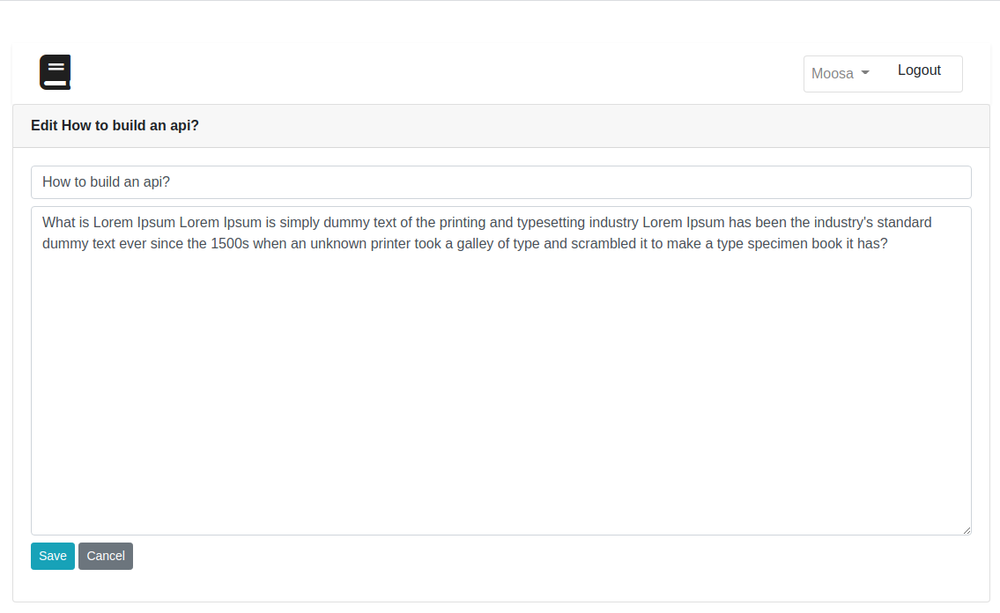
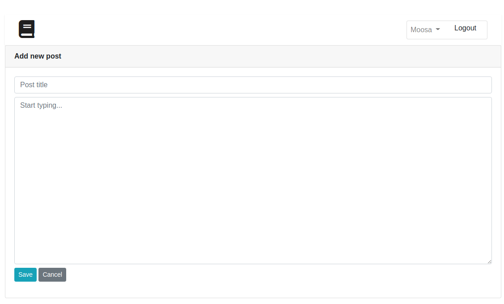
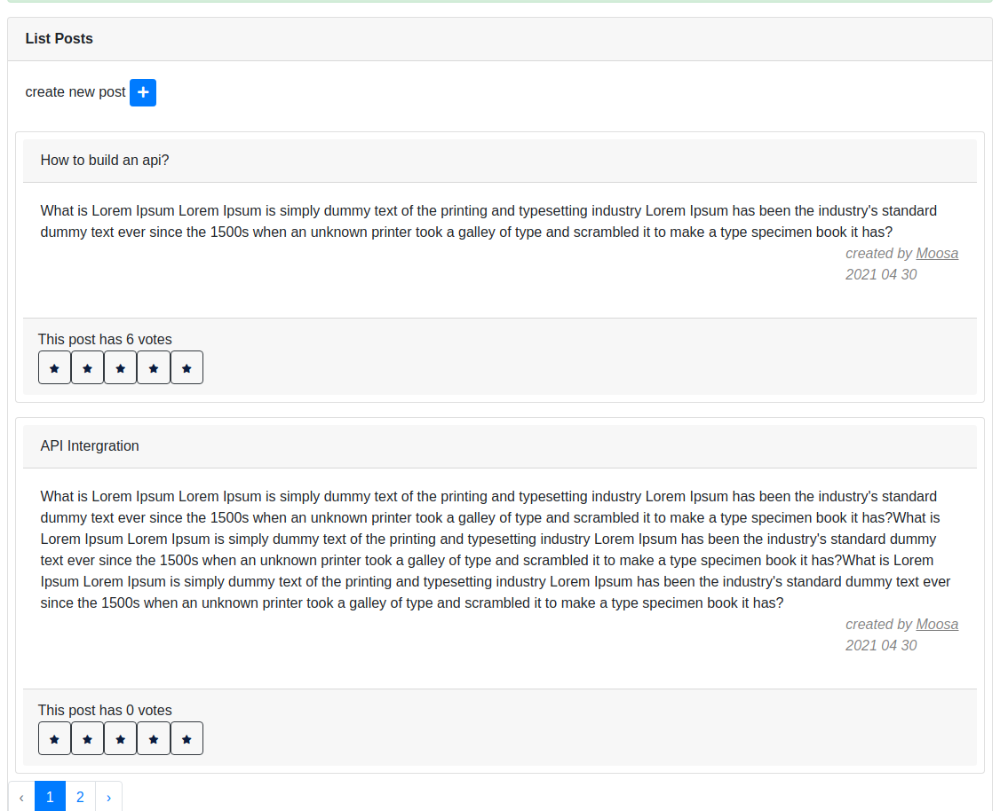
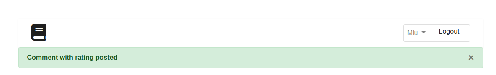

## setting up

Installing Composer

Before proceeding, make sure you have the "curl" command available:
sudo apt install curl -y
Then, use curl to download the official installation software:
curl -sS https://getcomposer.org/installer -o composer-setup.php

At this point, decide whether to install Composer globally on the system, or to install it as a local script, to recall occasionally when requested.
Global installation of Composer

To perform the global installation of Composer software use the following commad:
sudo php composer-setup.php --install-dir=/usr/local/bin --filename=composer

After typing this command, in the current folder called -composer- a file will be created.

To check its installation and view the installed version, use the command:

composer -v

Local installation of Composer
composer install
At this point, simply modify the file containing the ".env" environment variables (including full stop) in the Laravel directory:

nano .env

Apply the changes to the file as indicated below and save:

DB_CONNECTION=mysql
 DB_HOST=127.0.0.1
 DB_PORT=3306
 DB_DATABASE=laravel
 DB_USERNAME=laravel_user
 DB_PASSWORD=[password]
php artisan migrate [update DB details on your environment file .env]
php artisan serve

## deploying on lamp server
$ apt-get update
$ apt-get dist-upgrade
$ apt-get install apache2
 $ apt install composer
 sudo ufw allow in "Apache Full"

sudo service apache2 restart
To stop or start the service, use the "start" or "stop" commands:

sudo service apache2 stop
sudo service apache2 start

Installing MySQL

To install the MySQL database, use the apt command pointing the package "mysql-server" as follows:

sudo apt install mysql-server -y

Once completed the MySQL Database Service is available within the system. Like all other services, if necessary (for example after changing its configuration), MySQL can be restarted through the command:

sudo service mysql restart

Before proceeding, it is necessary to "secure" the current installation, that is to say, to start a procedure that will guide you in removing all anonymous users, disable the administrator login (root) remotely and remove the pre-installed test databases by default:

sudo mysql_secure_installation

The first question you are asked is whether to use the "VALID PASSWORD COMPONENT", a tool capable of rejecting any unsafe passwords during user creation:

VALIDATE PASSWORD COMPONENT can be used to test passwords
 …
 Would you like to setup VALIDATE PASSWORD component?
 
 Press y|Y for Yes, any other key for No: y
 
 There are three levels of password validation policy:
 
 LOW Length >= 8
 MEDIUM Length >= 8, numeric, mixed case, and special characters
 STRONG Length >= 8, numeric, mixed case, special characters and dictionary   file
 
 Please enter 0 = LOW, 1 = MEDIUM and 2 = STRONG:
 

To enable the component, type Y and choose a security level from 0: Low, 1: Medium or 2: High.

You will also be requested to enter a new password for the root user in order to access the service only through connections made from the same machine.

After entering the new password, continue by answering "y" to all the questions that will be asked.

Then, check the correct installation by logging in as an administrator user:

mysql -u root -p

By entering the root password indicated above, you log in to the management console.

To exit, type "exit:"

mysql> exit;
Installing PHP
To proceed with a minimal installation of PHP, the packages "php", "libapache2-mod-php" and "php-mysql" through the command: can be installed
sudo apt install php libapache2-mod-php php-mysql -y 
However, in case you need to use complex software, such as WordPress or other CMS, it may be useful to install other support packages through:

sudo apt install php-xml php-intl php-gd php-mbstring -y
After completing, restart Apache to apply the changes made:
sudo service apache2 restart

To verify correct PHP installation create an “info.php” file in the / var / www / html / folder using a text editor (for example, nano):
sudo nano /var/www/html/info.php

Copy the following string into the file you just opened:

<?php phpinfo(); ?>

Save the file and open the file address with your browser:

http://<SERVER_IP>/info.php

If everything works correctly, the installed current version of PHP, the extensions and all the current configuration data will be shown.

Installing Laravel

Once the installation of Composer is completed, proceed by installing the web application framework Larave. To do so, enter first the Apache root directory and remove the sample files present:

cd /var/www/html/
rm ./* 

Then, use Composer's create-project command to install Laravel in the current directory (using the "." Character at the end of the command):

composer create-project --prefer-dist laravel/laravel .

Proceed by correctly setting permissions for the newly created folders:

chown www-data:www-data ./* -R

Once completed, all you have to do is correct the Apache configuration, setting the one called ‘public’, just created by Lavarel, as the folder to serve. Then, open the file:

vim /etc/apache2/sites-available/000-default.conf
 

Inside you will find the entry "DocumentRoot" with the default value "/ var / www / html /", change it as follows:

DocumentRoot /var/www/html/public

Save the changes and restart the service:

sudo service apache2 reload

Configuring the Database

To allow Laravel to access a database, create and assign permissions to a user. Start the MySQL console by entering the password specified during installation:

mysql -u root -p 

Then, create the database and the user:

CREATE DATABASE laravel;
CREATE USER 'laravel_user'@'%' IDENTIFIED BY 'z98seQsXSn7711f';

Complete by assigning permissions on the newly created database:

GRANT ALL PRIVILEGES ON laravel. * TO 'laravel_user'@'%';
 
FLUSH PRIVILEGES;
 
exit

Once completed, by visiting your server address, the example page installed by Laravel should be seen:

http://<SERVER_IP>/info.php

## Time spent
+- 8 hours
